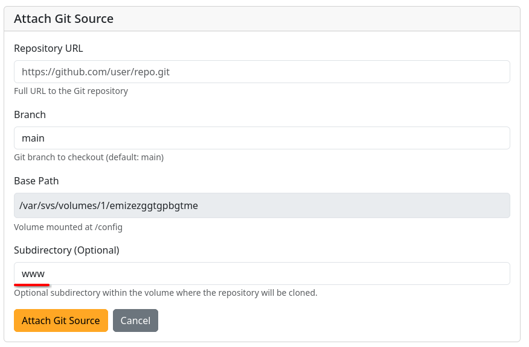

# NGINX Template

A template for the [NGINX](https://nginx.org) web server for hosting static websites, single-page applications, or as a reverse proxy.

## Usage

1. [Create a service](../../../guides/#create-a-service) using the NGINX template. _Add a [domain](../../../guides/#domains) if you wish_
2. [Upload your website files](../../../guides/#uploading-files) to the service's `config/www` directory

    ??? tip "Using a git source?"
        When using a git source, make sure you input `www` as the subdirectory. This is because the default destination is `/config`, and the template expects website files to be in `/config/www`. For example:

        

3. [Start the service](../../../guides/#control)
4. Access via your configured domain or assigned port

## Configuration

- **Port:** Container port 80 (HTTP)
- **Volume:** `/config` - Stores NGINX configuration and website files
- **Health Check:** Checks if NGINX responds on port 80

## Customization

NGINX configuration files are in `/config/` in your service's volume. Customize for SSL, rewrites, caching, etc.

## Definition

??? note "Source"
    ```json
    --8<-- "service_templates/nginx.json"
    ```
