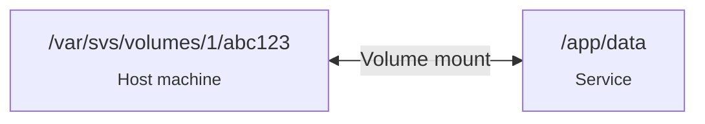
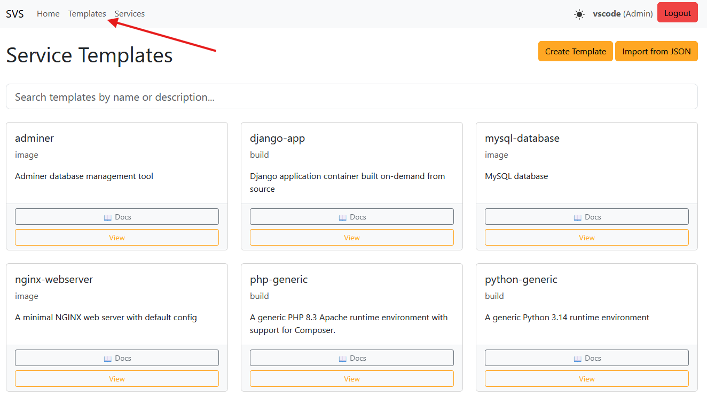
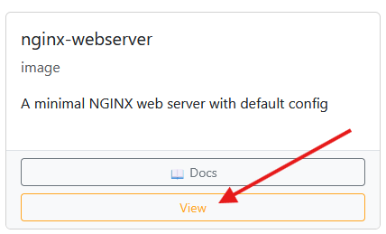
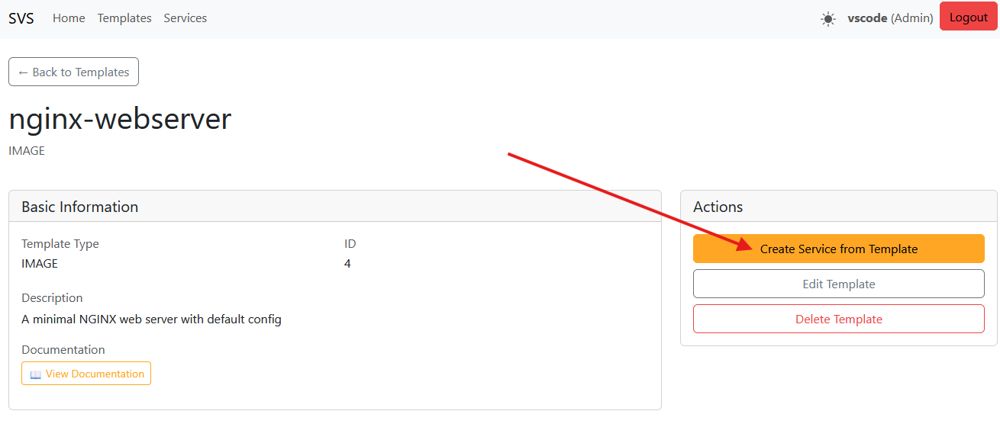
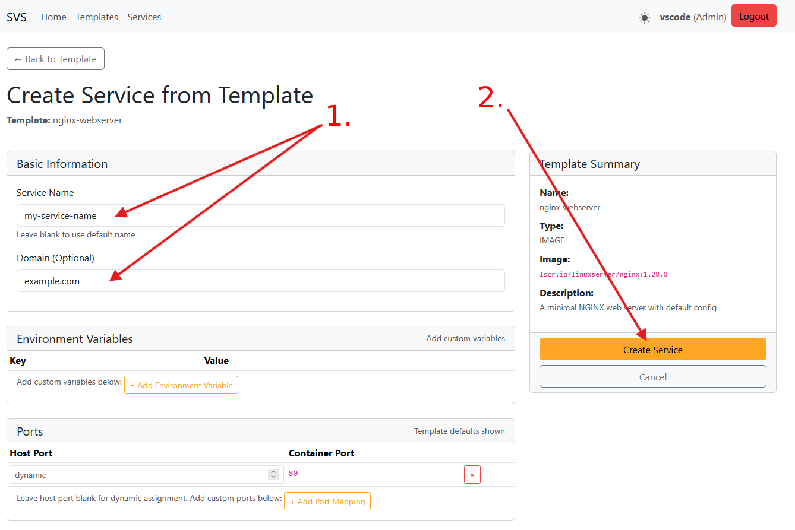
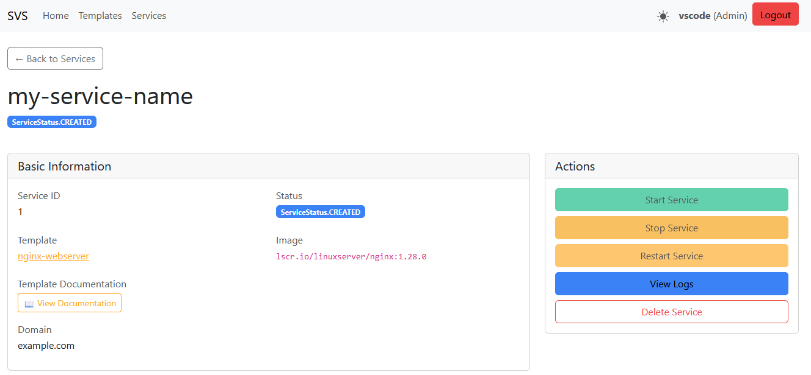
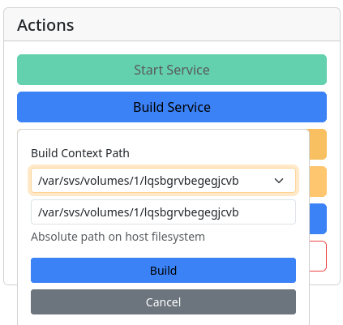

# Guides

This section contains various guides aimed at helping you configure and deploy your projects.

## Support and troubleshooting

If you encounter any issues or have questions while using SVS, use QnA section on [GitHub Discussions](https://github.com/kristiankunc/svs-core/discussions/categories/q-a).

## What do you want to deploy?

Be that a static website, a database, a web application, or something else - consult the [available templates](/api-reference/official-templates/index.md)

Further, continue on the respective guide for the type of service you want to deploy.

---

## Key concepts

Before deploying anything, it is important to understand some key concepts:

### Docker

SVS uses Docker to run services in isolated containers - essentially each service you deploy is an isolated Linux system. This is great for isolation but comes with some caveats.

### Volumes

One of the most important things to remember is that once a service gets shut down or deleted, all the changes made on the system are lost, including any files.

This is why SVS supports volumes - they are special folders on the host machine that are mounted into the service container. Anything stored in those folders will persist even if the service is deleted.

When you create a service, a volume is automatically created for it. You can also create additional volumes and mount them to the service if needed. Each volume has a host path (e.g., `/var/svs/volumes/1/abc123`) and a container path (e.g., `/app`). The container path is where the volume is mounted inside the service container, and the host path is where the data is stored on the server.




## Generic steps

The section below outlines the generic steps to follow when using any of the guides provided.

### Find a template

For every service, you need a template that defines how the service should be built and run. These templates are already provided or you can create your own (advanced users).

If you do not find a suitable template, contact your server administrator to import one from the [SVS Template Repository](https://github.com/kristiankunc/svs-core/tree/main/service_templates) or help you create a custom one.

Templates and services are keyed by their `IDs`. You will need to know the `ID` of the template you want to use to create a service. They are visible both in the CLI and Web.

#### Reference

All the official SVS templates have their respective documentation on the [Template Reference](../api-reference/official-templates/index.md) page.

#### CLI

Use the [`svs template list`](../cli-documentation/template.md#svs-template-list) command to list all templates available on your server.

```bash
sudo svs template list
```

Example output:

| ID | Name            | Type  | Description                                              |
|----|-----------------|-------|----------------------------------------------------------|
| 4  | adminer         | image | Adminer database management tool                         |
| 5  | django-app      | build | Django application container built on-demand from source |
| 6  | mysql-database  | image | MySQL database                                           |
| 7  | nginx-webserver | image | A minimal NGINX web server with default config           |

#### Web

Navigate to the _Templates_ section. There you will find a list of all templates.

[](./images/template-list.png)

---

### Create a service

Once you have identified the appropriate template for your service, you can proceed to create the service using that template.


#### CLI

Use the [`svs service create`](../cli-documentation/service.md#svs-service-create) command to create a new service based on the selected template.

```bash
sudo svs service create <your_service_name> <id_of_the_template>
```

The command allows some additional parameters, usually those do not need much tweaking since the default values from templates will usually work. Refer to the [CLI documentation](../cli-documentation/service.md#svs-service-create) for more details.

The only one you may want to use is the `--domain` option to specify the domain name for your service.
Example:

```bash
sudo svs service create my-static-site 7 --domain example.com
```

#### Web

On the _Templates_ page, locate the template you wish to use for your service. Click on the _View_ button associated with that template.

[](./images/template-list-view.png)

This action will take you to the template's detailed view page. On that page, click _Create Service from Template_.

[](./images/service-create-from-template.png)

You will be presented with a form to fill in the necessary details for your new service, such as the service name and domain. If you are unsure about any of the fields, the default values provided should suffice for most cases. After completing the form, submit it to create your service.

[](./images/service-create-form.png)

---

### Manage your service

After creating your service, you can manage it and see its details.

#### CLI

##### Quick overview

First of all, you can list all services using the [`svs service list`](../cli-documentation/service.md#svs-service-list) command.

```bash
sudo svs service list
```

Example output:

| ID | Name  | Owner      | Status | Template            |
|----|-------|------------|--------|---------------------|
| 4  | nginx | name (1) | exited | nginx-webserver (7) |

From there, you can see a quick overview of all your services, their `IDs`, owners, current status, and the templates they are based on.

##### Detailed view

To see more details about a specific service, use the [`svs service get`](../cli-documentation/service.md#svs-service-get) command followed by the service `ID`.

```bash
sudo svs service get <service_id>
```

Example output:
```bash
Service(
    id=10,
    name=nginx,
    template_id=13,
    user_id=1,
    domain=nginx.example.com,
    container_id=709b02cd2335af02e84d2031a486bbebeb46955496009744445ade6668cc0b50,
    image=lscr.io/linuxserver/nginx:latest,
    exposed_ports=['ExposedPort(65205=80)'], # Format: ExposedPort(<host_port>=<container_port>)
    env=[],
    volumes=['Volume(/config=/var/svs/volumes/1/lmrfgsboowcsmute)'], # Format: Volume(<container_path>=<host_path>)
    command=None,
    healthcheck=Healthcheck(test=['CMD', 'curl', '-f', 'http://localhost/'], interval=30, timeout=10, retries=3, start_period=5),
    labels=['Label(service_id=10)', 'Label(svs_user=name)'],
    args=[], status=ServiceStatus.EXITED,
    git_sources=[]
)
```

From there, you can see all the details about your service, including its domain, container ID, image, exposed ports, environment variables, volumes, healthcheck configuration, and current status.

##### Control

Once you have the service `ID`, you can also start, stop, restart, delete and view logs of your service using the respective commands:

```bash
sudo svs service start <service_id>
sudo svs service stop <service_id>
sudo svs service restart <service_id>
sudo svs service delete <service_id>
sudo svs service logs <service_id>
```

More details about these commands can be found in the [CLI documentation](../cli-documentation/service.md).
#### Web

Navigate to the _Services_ section. There you will find a list of all services. On the service card, click on _View_ to see more details about the service. From there, you can start, stop, restart, or delete the service using the respective buttons.

[](./images/service-management.png)

### Domains

To access your service via a custom domain name, you need to add a domain to it. **You can do this during the service creation.**

Generally, SVS tends to be hosted under one domain, for example, `example.com`. In that case, you can access your service via a subdomain like `my-service.example.com` by adding `my-service.example.com` as a domain to your service. If you add a domain that is not a subdomain of the main domain, for example, `anotherdomain.com`, you will need to configure the DNS records for that domain to point to your server's IP address.

---

### DNS

SVS automatically configures Docker DNS for inter-service communication. Each service can communicate with other services using Docker's internal DNS resolution.

#### Container naming

All service containers are named using the pattern `svs-{id}`, where `{id}` is the service ID. For example, if your service has ID `5`, its container will be named `svs-5`.

#### Connecting services

To connect one service to another (e.g., connecting a web application to a database), use the container name `svs-{id}`:

**Example: Connecting to a database service**

If you have a PostgreSQL database service with ID `3`, you can connect to it from other services using:

```
Host: svs-3
Port: 5432 (the container port, not the host port)
```

For example, in a Django `settings.py`:

```python
DATABASES = {
    'default': {
        'ENGINE': 'django.db.backends.postgresql',
        'NAME': 'mydatabase',
        'USER': 'myuser',
        'PASSWORD': 'mypassword',
        'HOST': 'svs-3',  # Use the service container name
        'PORT': '5432',   # Use the container port
    }
}
```

**Important notes:**

- Always use the **container port**, not the host port, for inter-service communication
- Services must be in the same Docker network (by default, services owned by the same user share a network)
- External access to services uses the host port and server IP address

---

### Uploading files

???+ note

    Uploading files is currently only supported via GIT and SSH (scp, sftp). Support for direct file uploads via the Web UI is planned for a future release.


#### GIT

##### CLI

Each service can have multiple GIT sources configured. This allows you to deploy your code directly from a GIT repository. You can use any GIT provider (GitHub, GitLab, Bitbucket, etc.).

**Adding a git source:**

Use the [`svs service add-git-source`](../cli-documentation/service.md#svs-service-add-git-source).

```bash
sudo svs service add-git-source <service_id> <git_url> <destination_path> --branch <branch_name>
```

Example:
```bash
sudo svs service add-git-source 7 https://github.com/user/my-app.git /var/svs/volumes/1/randomid --branch main
```

**Downloading/updating from git:**

Use the [`svs service download-git-source`](../cli-documentation/service.md#svs-service-download-git-source).

```bash
sudo svs service download-git-source <git_source_id>
```

This clones or pulls the latest code from the repository to the configured destination path.

**Deleting a git source:**

Use the [`svs service delete-git-source`](../cli-documentation/service.md#svs-service-delete-git-source).

```bash
sudo svs service delete-git-source <git_source_id>
```

To see all git sources for a service, use `svs service get <service_id>` and look at the `git_sources` field.

##### Web

After creating a service, scroll down to the git sources section. Click on _Add Git Source_ and fill in the form with the repository URL, destination path, and branch name. After adding the git source, you can click _Download Git Source_ to clone or pull the latest code to the specified destination path.

---

### Building services

SVS supports two types of templates:

1. **Image templates** - Use pre-built Docker images from registries (e.g., NGINX, PostgreSQL, MySQL)
2. **Build templates** - Build Docker images on-demand from your source code (e.g., Django, Python, PHP, SvelteKit)

#### Build process

For build templates, you need to:

1. Create a service from a build template
2. Upload your source code to the service's volume
3. Build the Docker image: `sudo svs service build <service_id> <volume_path>`
4. Start the service

The volume's host path becomes the build context. All files in the volume are available during the Docker build.

**If the build fails**, a detailed error log is written to `docker_build_error.log` in your volume directory (the build context).

##### CLI

**Example:**

```bash
# 1. Create service
sudo svs service create my-app 5 --env APP_NAME=myproject

# 2. Get volume path
sudo svs service get 7
# Shows: volumes=['Volume(/app=/var/svs/volumes/1/abc123)']

# 3. Upload code via GIT
sudo svs service add-git-source 7 https://github.com/user/my-app.git /var/svs/volumes/1/abc123 --branch main
sudo svs service download-git-source 1

# Or upload via SSH
scp -r ./my-app/* user@server:/var/svs/volumes/1/abc123/

# 4. Build
sudo svs service build 7 /var/svs/volumes/1/abc123

# 5. Start
sudo svs service start 7
```

To rebuild after code updates, re-download the git source or re-upload via SSH, then run the build command again.

##### Web

You can use the same process as the CLI, upload your files to the volume via GIT or SSH, then click the _Build_ button on the service's detailed view page.

Set the build context to the volume path (e.g., `/var/svs/volumes/1/abc123`) and start the build. If the build fails, check the `docker_build_error.log` file in your volume directory for detailed error logs.

[](./images/service-build.png)
